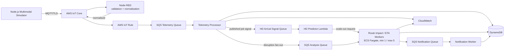

# Predictive Autoscaling for a Public Transport IoT Pipeline

SIT314 Distinction and High Distinction project — Lorenzo Dario Ben

A simulated public transport authority monitors buses, trams, trains and passenger
demand, detects operational disruption, and models the route impact of that
disruption using a queue-decoupled, automatically scaled microservice pipeline.

The Distinction baseline uses a seeded workload generator, SQS-backed workers
and reactive backlog-per-task autoscaling. The High Distinction extension adds a
short-horizon arrival predictor that can request extra workers while retaining
the reactive safeguards. Twelve matched AWS runs compare reactive and hybrid
control under a gradual ramp and an abrupt burst. The repository includes the
source, tests, frozen workloads, raw run records, reviewed aggregate and final
figures. See the [study and results](docs/HD_REPORT.md) and
[reviewed comparison](artifacts/hd-analysis/comparison.md).

---

## Architecture



The **route-impact / ETA worker is the primary autoscaling target**. It polls the
analysis queue, so it needs no load balancer. The HD predictor observes accepted
analysis-job arrivals and can request scale-out ahead of measured queue pressure;
target tracking and the fast reactive alarm remain active in both comparison arms.

Full detail, including why each component exists: [docs/ARCHITECTURE.md](docs/ARCHITECTURE.md).

---

## Repository structure

```
schemas/            JSON Schema (draft 2020-12) for all 8 message types
simulator/          Configurable multimodal IoT simulator (Volume/Velocity/Variety)
node-red/           Flow-based validation + normalisation, with per-mode branches
shared/             Config, logging, validation, queue/store/metrics adapters
services/
  telemetry-processor/   SQS -> DynamoDB state + disruption fan-out
  route-impact-worker/   SQS -> deterministic ETA/impact -> results + alerts
  notification-worker/   SQS -> simulated delivery records
experiments/        Baseline and HD workloads, runners, controller and analysis
infrastructure/     CloudFormation stacks + PowerShell/bash deployment scripts
scripts/            Local broker, bridge, autoscaler, demos, evidence tooling
docs/               Architecture, deployment, study, results and figures
artifacts/          Reviewed HD AWS runs, aggregate and charts
evidence/           Preliminary local measurements cited by baseline documents
```

---

## Prerequisites

| Tool | Required | Notes |
|---|---|---|
| Node.js 20+ | Yes | Developed on v22.19.0 |
| npm | Yes | Workspaces are used |
| Docker | For containers only | Verified with Docker Desktop 4.47.0 |
| AWS CLI | For a new AWS deployment only | AWS CLI v2; check with `aws --version` |
| AWS credentials | For a new AWS deployment only | Use a short-lived profile or role; never commit credentials |

Everything except container builds and AWS deployment runs with Node.js alone.

```bash
npm install
npm run verify-env
```

`verify-env` reports the capabilities available in the current environment.

---

## Local setup and the full pipeline

The whole pipeline runs locally with no AWS account. Node-RED is a long-running
editor process, so it is started separately:

```bash
npm run node-red
```

Then, in a second terminal:

```bash
npm run demo:local
```

This starts the local MQTT broker, the normalised→queue bridge, the telemetry
processor and both workers, runs the checkpoint scenario through them, and prints
what ended up in each queue and table.

Node-RED's editor is at <http://127.0.0.1:1880> and the flow is importable from
`node-red/flows.json`.

---

## Simulator examples

Volume and Velocity are both command-line controlled — no source edits:

```bash
npm run simulate -- --buses 10 --trams 5 --trains 2 --locations 10 --interval-ms 5000
```

```bash
npm run simulate -- --buses 100 --trams 25 --trains 15 --locations 100 --interval-ms 1000
```

Publish to the local broker instead of stdout, with a disruption scenario:

```bash
npm run simulate -- --scenario bus-breakdown --disrupt-vehicle BUS-007 --target mqtt --duration-seconds 60
```

Prove Node-RED's rejection path by deliberately corrupting 5% of events:

```bash
npm run simulate -- --invalid-rate 0.05 --target mqtt --duration-seconds 30
```

Key flags: `--buses --trams --trains --locations --interval-ms --duration-seconds
--seed --scenario --target --mqtt-mode --invalid-rate --duplicate-rate
--disrupt-vehicle --out`. Run `npm run simulate -- --help` for the full list.

Scenarios: `normal`, `bus-breakdown`, `tram-blockage`, `train-cancellation`,
`multimodal-disruption`.

**Determinism:** the same `--seed` plus the same configuration reproduces the same
logical workload. This is what makes the fixed-worker and autoscaled experiments
comparable.

---

## The three Vs

**Volume** — the number of buses, trams, trains and demand locations, the run
duration, and the incident fan-out size are all runtime configuration. One incident
fans out into 50, 250, 750 or 1500 independent analysis jobs depending on stage.

**Velocity** — the reporting interval is a flag. The same fleet reporting every
10s, 5s or 1s produces three different arrival rates against identical Volume.

**Variety** — four genuinely different payload shapes, not four renamed copies.
Buses carry `roadSegmentId`/`nextStopId`, trams carry
`trackSegmentId`/`direction`, trains carry `stationId`/`platform`/`carriageCount`,
and location-demand events have no vehicle, speed or capacity at all. Health
vocabularies differ per mode (`breakdown` / `blocked` / `cancelled`). Node-RED has a
separate, visible validation branch per mode before normalisation.

---

## Node-RED

The flow implements:

```
MQTT in (transport/raw/#)
   -> identify mode
      -> validate bus     -\
      -> validate tram     |-> normalise -> MQTT out (transport/normalized/<mode>)
      -> validate train    |
      -> validate demand  -/
      -> reject -> MQTT out (transport/rejected/<mode>) + debug
```

Function-node source lives in `node-red/functions/*.js` and `flows.json` is
generated from it by `npm run flows:build` (`npm run flows:check` verifies they are
in sync). This keeps the flow visually inspectable in the editor **and**
unit-testable — `node-red/test/flow.test.js` executes the real function-node source
against fixtures.

See [node-red/README.md](node-red/README.md).

---

## AWS configuration

Copy `.env.example` to `.env` and fill in the endpoint and certificate paths:

```
AWS_REGION=us-east-1
AWS_IOT_ENDPOINT=xxxxxxxx-ats.iot.us-east-1.amazonaws.com
AWS_IOT_CERT_PATH=certs/device.pem.crt
AWS_IOT_PRIVATE_KEY_PATH=certs/private.pem.key
AWS_IOT_CA_PATH=certs/AmazonRootCA1.pem
QUEUE_BACKEND=aws
STORE_BACKEND=aws
METRICS_BACKEND=aws
```

`.env` and `certs/*` are gitignored. Nothing secret is ever committed or logged.
The simulator fails with an explicit message if `--mqtt-mode aws` is selected but
the TLS configuration is missing.

Deployment sequence: [docs/AWS_DEPLOYMENT.md](docs/AWS_DEPLOYMENT.md).

---

## Testing

```bash
npm test
```

The test suite covers RNG determinism, all four generators, CLI
and config resolution, corruption injection, schema validation, the real Node-RED
function-node source, the local queue's visibility-timeout and DLQ redrive
behaviour, conditional-write idempotency, the telemetry processor's disruption
detection and fan-out, the route-impact ETA model, the notification worker, and the
CloudFormation templates. It also checks the HD controller, workload timing,
AWS signal processing, experiment accounting and evidence analysis.

Static infrastructure validation is a separate gate (requires `cfn-lint`, which is
installed with `pip install --user cfn-lint`):

```bash
npm run lint:infra
```

This is an offline check; it never contacts AWS. Run it after changing any
CloudFormation template or deployment script.

Reliability behaviour has its own one-command demonstration:

```bash
npm run demo:reliability
```

It runs four controlled scenarios — duplicate event, stale telemetry, retry after
worker failure, and DLQ redrive with a healthy message proven untouched — and
prints a PASS/FAIL summary.

---

## Docker

Ingestion only (broker + Node-RED):

```bash
docker compose up -d
```

The whole pipeline, six containers:

```bash
docker compose --profile workers up -d
docker compose ps
```

That brings up the broker, Node-RED, the normalised-to-queue bridge (the local
stand-in for the AWS IoT rule) and the three services, all sharing one volume.
Before publishing, wait until the Node-RED logs say both `Started flows` and
`Connected to broker`; `docker compose up -d` only confirms that the container
started, not that the MQTT subscription is ready. Then drive it from the host:

```bash
docker compose logs --tail 30 node-red
npm run simulate -- --scenario bus-breakdown --disrupt-vehicle BUS-007 --target mqtt --duration-seconds 20
docker compose logs telemetry-processor route-impact-worker
```

If another local MQTT broker already owns loopback port 1883, select a different
**host** port while leaving the Compose services on their internal port 1883:

```powershell
$env:MQTT_HOST_PORT = '1884'
docker compose --profile workers up -d
$env:MQTT_LOCAL_PORT = '1884'
npm run simulate -- --scenario bus-breakdown --disrupt-vehicle BUS-007 --target mqtt --duration-seconds 20
```

**Verified**, not just written: all four images build, run as a non-root `app`
user, contain no secrets and no dev dependencies, process real work, and exit 0
on `docker stop` after finishing in-flight jobs. A run of the full stack
processed 270 events into 356 route-impact results and 1372 simulated
notifications with nothing dead-lettered.

Note that the Compose `node-red` service publishes host port 1880, so stop a host
`npm run node-red` first.

The later Distinction and HD experiments did run on AWS ECS Fargate. The local
Compose procedure above remains useful for development and does not reproduce
Fargate startup or CloudWatch timing.

---

## Distinction baseline deployment

```powershell
./infrastructure/scripts/deploy.ps1 -Stacks queues,tables
./infrastructure/scripts/deploy.ps1 -Stacks iot-rule
./infrastructure/scripts/build-and-push.ps1
$AccountId = aws sts get-caller-identity --query Account --output text
$Image = "$AccountId.dkr.ecr.$env:AWS_REGION.amazonaws.com/sit314-transport-route-impact-worker:latest"
$Vpc = aws ec2 describe-vpcs --filters "Name=isDefault,Values=true" --query "Vpcs[0].VpcId" --output text
$Subnets = (aws ec2 describe-subnets --filters "Name=vpc-id,Values=$Vpc" --query "Subnets[].SubnetId" --output text) -split "\s+"
./infrastructure/scripts/deploy.ps1 -Stacks ecs -RouteImpactImage $Image -VpcId $Vpc -SubnetIds $Subnets
./infrastructure/scripts/deploy.ps1 -Stacks scaling
```

Stacks are `queues`, `tables`, `iot-rule`, `ecs`, `scaling`, deployed in that
dependency order. Every stack is scoped by `-Prefix sit314-transport`. In a
restricted account, pass the existing lab role ARNs (`-ExistingExecutionRoleArn`
and friends) so the templates never attempt role creation. The image-push
script creates or verifies ECR, logs Docker in, builds, tags, pushes and verifies
the image digest before the ECS command is allowed to run. See the full
read-only Academy preflight and live gates in `docs/AWS_DEPLOYMENT.md`.

---

## Scalability experiments

```bash
# Experiment A - one fixed worker
npm run experiment -- --config experiments/incident/stage-1.json --worker-mode fixed

# Experiment B - identical seed and workload, autoscaled 1..5
npm run experiment -- --config experiments/incident/stage-1.json --worker-mode autoscale
```

Each run writes `config.json`, `summary.json`, `metrics.csv` and `scaling.csv` to a
timestamped directory under `artifacts/runs/`. Promote a run into the committed
evidence set with `npm run evidence -- --promote latest`.

**Preliminary measured result** (local backends, stage 1, seed 3142026, identical
550-job workload, 50 ms processing cost + fixed CPU work per job):

| | Fixed 1 worker | Autoscaled 1→5 |
|---|---|---|
| Throughput | 3.20 jobs/s | **5.41 jobs/s** |
| Time to drain | 171.7 s | **101.7 s** |
| Peak queue depth | 380 | **290** |
| p95 processing | 750 ms | 857 ms |
| Tasks observed | 1 | 1 → 4 (2 scale-outs, 1 scale-in) |
| Jobs lost / duplicated results / DLQ | 0 / 0 / 0 | 0 / 0 / 0 |

Autoscaling raised sustainable throughput by ~69% on an identical workload with no
job loss and no duplicate results.

**Stage 2** (tram blockage, identical 750-job workload in both arms via
`--incidents 3`) is the clearer result:

| | Fixed 1 worker | Autoscaled 1→5 |
|---|---|---|
| Results produced | 474 of 750 | **750 of 750** |
| Left queued at drain timeout | 280 | **0** |
| Throughput | 2.93 jobs/s | **7.38 jobs/s** |
| Peak oldest-message age | 145 s | **83 s** |
| Tasks observed | 1 | 1 → 5 |
| Jobs lost / duplicated / DLQ | 0 / 0 / 0 | 0 / 0 / 0 |

The single worker never finished the workload at all, while the autoscaled service
completed every job and drained the queue. Both stages are still classed UNSTABLE
by the oldest-message-age criterion, which is the expected and useful outcome — it
locates a breaking point rather than declaring success. The autoscaled stage 2 arm
reached the cap of 5 tasks and was still behind, so the **local preliminary
breaking point lies between stage 1 and stage 2** (local harness only, not a
prediction of the AWS breaking point).

Formal AWS comparisons use the separate count-bounded runner, which never starts
local consumers of SQS:

```bash
npm run experiment:aws -- --config experiments/incident/stage-1.json --worker-mode fixed --repeat 1
npm run experiment:aws -- --config experiments/incident/stage-1.json --worker-mode autoscale --repeat 1
```

It requires temporary AWS credentials and writes raw evidence under
`artifacts/aws-runs/`; see [scalability testing](docs/SCALABILITY_TESTING.md),
[AWS deployment](docs/AWS_DEPLOYMENT.md) and the
[Distinction results](docs/DISTINCTION_FINAL_RESULTS.md). The existing
`npm run experiment` command remains the local preliminary harness.

Methodology, thresholds and the breaking-point definition:
[docs/SCALABILITY_TESTING.md](docs/SCALABILITY_TESTING.md).

---

## High Distinction predictive autoscaling study

The HD controller fits a rolling linear trend to successfully published analysis
jobs in eight 10-second bins, forecasts 80 seconds ahead and requests additional
ECS tasks only when the rising trend persists. It never scales in. Both matched
arms retain the same backlog-per-task target tracking and fast reactive alarm.
The HD resources use their own `sit314-hd-transport` prefix and metric namespace.

The frozen [experiment matrix](docs/HD_EXPERIMENT_MATRIX.md) compares reactive
and hybrid control for a predictable ramp and a sudden burst, with three valid
repeats per arm and workload. Each run used the same logical jobs and worker
configuration within its pair. The [run reviews](docs/experiments/HD_AWS_RUN_LOG.md)
and [raw artifacts](artifacts/hd-aws-runs/) retain timing, queue, CloudWatch,
worker-readiness and accounting evidence. An invalid partial attempt remains
preserved and excluded from the aggregate.

| Reviewed AWS mean | Reactive | Hybrid | Interpretation |
| --- | ---: | ---: | --- |
| Ramp peak visible backlog | 913 jobs | 51.7 jobs | 94.3% lower with hybrid control. |
| Ramp peak genuine BPT | 796.3 | 43.0 | 94.6% lower. |
| Ramp worker task-seconds | 634.0 | 1,055.8 | 66.5% higher capacity-time. |
| Burst peak visible backlog | 879.3 jobs | 432.0 jobs | 50.9% lower; no pre-burst prediction. |
| Burst worker task-seconds | 1,760.0 | 2,067.7 | 17.5% higher capacity-time. |

All 12 valid runs completed their declared jobs without errors, duplicate
results, DLQ jobs or unaccounted jobs. The results are descriptive for this
synthetic workload, one AWS region and three repeats per arm; task-seconds are
not a monetary cost estimate. Read the [full study](docs/HD_REPORT.md),
[reviewed aggregate](artifacts/hd-analysis/comparison.md),
[machine-readable final data](docs/hd-final-data/) and
[figures](docs/hd-final-figures/) for methods, contrary outcomes and limitations.

---

## Security

- MQTT to AWS IoT Core uses mutual TLS on port 8883.
- No credentials, keys or certificates are committed; `.gitignore` covers
  `.env`, `certs/*`, `*.pem`, `*.key`, `*.crt`. Historical AWS artifacts contain
  account and resource identifiers for provenance; treat those as public data.
- No IAM users and no long-lived access keys are created. Templates accept
  existing role ARNs so restricted accounts are supported.
- Queues and tables are never public; access is by IAM role only.
- Failure injection is off by default and must be switched on explicitly.
- Notifications are simulated — no SMS, email or paid service is ever contacted.

Full detail: [docs/SECURITY.md](docs/SECURITY.md).

---

## Cleanup

AWS resources are removed by deleting the project's own CloudFormation stacks, in
reverse dependency order. The cleanup script is scoped exclusively to resources
carrying this project's prefix and is never run automatically:

```bash
./infrastructure/scripts/cleanup.sh
```

Local `local-data/` is disposable. The tracked HD run artifacts and aggregate are
research evidence and should be retained; generated scratch runs can be removed
only after separating them from the committed evidence set.

---

## Project status and reproducibility

The local pipeline and the isolated HD AWS experiment were executed. The final
HD dataset contains 12 manually reviewed valid runs plus a separately retained
invalid attempt. The [study](docs/HD_REPORT.md) explains the outcomes and
limitations; [raw artifacts](artifacts/hd-aws-runs/),
[aggregate](artifacts/hd-analysis/aggregate.json),
[reviewed run table](docs/hd-final-data/all-reviewed-runs.csv) and
[figure source data](docs/hd-final-data/) support inspection. The
[AWS runbook](docs/HD_AWS_RUNBOOK.md) records the guarded procedure. It is a
historical execution guide: any new cloud run requires fresh credentials,
resource-state checks and budget review. The repository does not assert that
the original AWS resources are still running.
