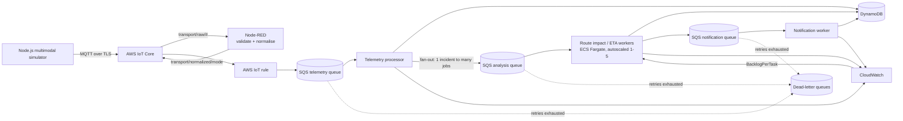
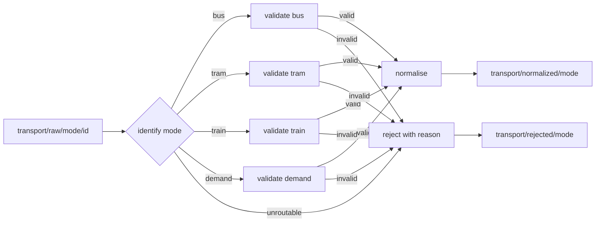

# Architecture

## The problem

A public transport authority runs buses, trams and trains across a shared
network. When something goes wrong - a bus breaks down, a tram blocks a track
segment, a train service is cancelled - the consequences are not confined to the
vehicle involved. Every downstream stop needs a revised arrival estimate, and
passengers, operators, control-room staff and the authority itself all need to
be told.

One failure event therefore produces a large amount of downstream work, and the
amount is unpredictable. That is the property this architecture is built around.

## Full pipeline



Rejected events never reach the queue:



## Components

| Component | What it does | Why it is here |
|---|---|---|
| **Simulator** (`simulator/`) | Generates bus, tram, train and location-demand events and publishes them over MQTT | Supplies Volume, Velocity and Variety without needing physical hardware |
| **AWS IoT Core** | MQTT broker with mutual-TLS device authentication | Managed, scalable ingestion; devices authenticate with certificates, not passwords |
| **Node-RED** (`node-red/`) | Mode-specific validation, then normalisation to one envelope | Flow-based processing; the place where Variety is visibly handled and bad data is stopped |
| **AWS IoT rule** (`infrastructure/cloudformation/iot-rule.yaml`) | `SELECT * FROM 'transport/normalized/+'` into SQS | Managed integration; no custom code between the flow and the queue |
| **Telemetry processor** (`services/telemetry-processor/`) | Idempotent state updates, disruption detection, fan-out | Turns one event into many independent jobs |
| **SQS queues** | Telemetry, analysis and notification queues, each with a DLQ | Decouple producers from consumers and absorb bursts |
| **Route-impact worker** (`services/route-impact-worker/`) | Deterministic ETA/impact per affected location | The primary autoscaling target |
| **Notification worker** (`services/notification-worker/`) | Simulated delivery records | Completes the chain; secondary autoscaling candidate |
| **DynamoDB** | Processed events, current state, results, notifications | Idempotency ledger and persisted results |
| **CloudWatch** | Metrics and logs | Evidence for scalability and bottleneck identification |
| **Application Auto Scaling** | Scales the route-impact service 1-5 on backlog per task | Turns queue backlog into capacity |

## Why the queue is what makes this scalable

Without a queue, the telemetry processor would have to call the route-impact
calculation directly. Its throughput would then be bounded by the slowest
downstream component, a burst would either block ingestion or be dropped, and
adding capacity would mean changing code.

With a queue:

- **Producers and consumers are decoupled.** The processor finishes as soon as
  the jobs are enqueued. A burst becomes queue depth, not lost data.
- **The queue is the buffer.** 1500 jobs arriving in one second is not a
  failure; it is a backlog that drains.
- **Capacity is a dial.** Consumers are stateless and interchangeable, so
  throughput scales with the number of them.
- **Queue depth is a measurable signal.** It is exactly what the autoscaling
  policy reacts to.
- **Failure is contained.** A message that cannot be processed is retried and
  eventually dead-lettered; it does not take the pipeline down.

## Why jobs are split into independent units

A bus breakdown affecting five stops becomes 50 analysis jobs, not one job that
computes five results. Each job:

- carries everything it needs (incident context, location, mode, route),
- depends on no other job's output,
- writes its own result under its own key.

Independence is what allows any number of workers to consume the queue
concurrently with no coordination, and it means a worker that dies mid-job costs
exactly one job, which is redelivered.

## Why idempotency is required

SQS is **at-least-once**. A message will occasionally be delivered twice: the
visibility timeout expires while a slow job is still running, a worker dies
after processing but before deleting, or a transient error triggers a retry.

Every stage therefore claims its unit of work with a conditional write before
doing anything with side effects:

| Stage | Key | Condition |
|---|---|---|
| Telemetry processor | `eventId` | `attribute_not_exists(eventId)` |
| Telemetry processor (state) | `entityId` | `attribute_not_exists(entityId) OR #ts < :ts` |
| Route-impact worker | `jobId` | `attribute_not_exists(jobId)` |
| Notification worker | `notificationId` | `attribute_not_exists(notificationId)` |

If the claim fails, the work has already been done and the stage logs
`[DUPLICATE_SKIPPED]` and returns successfully. Without this, one redelivered
breakdown event would create 100 analysis jobs instead of 50 and notify every
passenger twice.

The `putIfNewer` variant additionally stops an out-of-order telemetry event from
overwriting fresher vehicle state - the network can reorder messages, so "latest
received" is not the same as "latest measured".

Job, alert and notification ids are **derived** (a hash of stable inputs) rather
than random, so a retry regenerates exactly the same identifiers and the
conditional writes recognise them.

## Why a message is deleted only after success

The worker runtime (`shared/worker/`) deletes a queue message only after the
handler resolves. If the handler throws, the message is simply left alone: the
visibility timeout expires, the message becomes visible again, and it is
retried. After `maxReceiveCount` attempts the redrive policy moves it to the
dead-letter queue.

This is why nothing is lost when a task is killed by a scale-in event.

## Backlog per active task

Queue depth alone is not a scaling signal: 400 queued jobs is a crisis for one
worker and routine for five. The signal is how much work each running task is
responsible for:

```
BacklogPerTask = ApproximateNumberOfMessagesVisible / max(RunningTaskCount, 1)
```

SQS does not publish this, so a scheduled Lambda computes it once a minute from
the queue attributes and the ECS running task count, and publishes it to
CloudWatch. A target-tracking policy keeps it near a configurable target
(preliminary value: 75 jobs per task, from the approved 50-100 range).

The control loop:

```
backlog rises -> BacklogPerTask rises above target
              -> Application Auto Scaling raises desired count
              -> more tasks consume the same queue
              -> backlog drains, BacklogPerTask falls
              -> desired count returns toward the minimum of 1
```

## Volume, Velocity and Variety

**Volume** is *how much*: the number of vehicles, demand locations, analysis
jobs, results and notification records. It is changed with entity counts:
`--buses 100 --trams 25 --trains 15 --locations 100`.

**Velocity** is *how fast*: the rate at which events and jobs arrive. It is
changed with the reporting interval: `--interval-ms 1000` produces ten times the
event rate of `--interval-ms 10000` for the same fleet. Volume and Velocity are
independent - 100 vehicles reporting every 10 seconds and 100 vehicles reporting
every second are the same Volume at ten times the Velocity, and they stress
different parts of the system.

**Variety** is *how different*: four structurally distinct payload types, not
one payload with a renamed field. Node-RED validates each in its own branch
before normalising them into a shared envelope that preserves the mode-specific
fields under `modeData`.

## Local development architecture

The same business logic runs locally with different adapters, so the project is
usable and testable before any AWS access exists:

| Production | Local substitute | Selected by |
|---|---|---|
| AWS IoT Core | `aedes` MQTT broker on localhost | `MQTT_MODE=local` |
| AWS IoT rule | `scripts/normalized-bridge.js` | `QUEUE_BACKEND=local` |
| SQS | File-backed queue (`shared/aws/local-queue.js`) | `QUEUE_BACKEND=local` |
| DynamoDB | File-backed store (`shared/aws/store.js`) | `STORE_BACKEND=local` |
| CloudWatch | CSV/JSONL metric files | `METRICS_BACKEND=local` |
| ECS + Application Auto Scaling | `scripts/local-autoscaler.js` spawning worker processes | experiment runner |

The services themselves contain **no local/AWS branching**. They see one queue
interface and one store interface. See `docs/IMPLEMENTATION_DECISIONS.md` for
why this was chosen and what its limits are.
